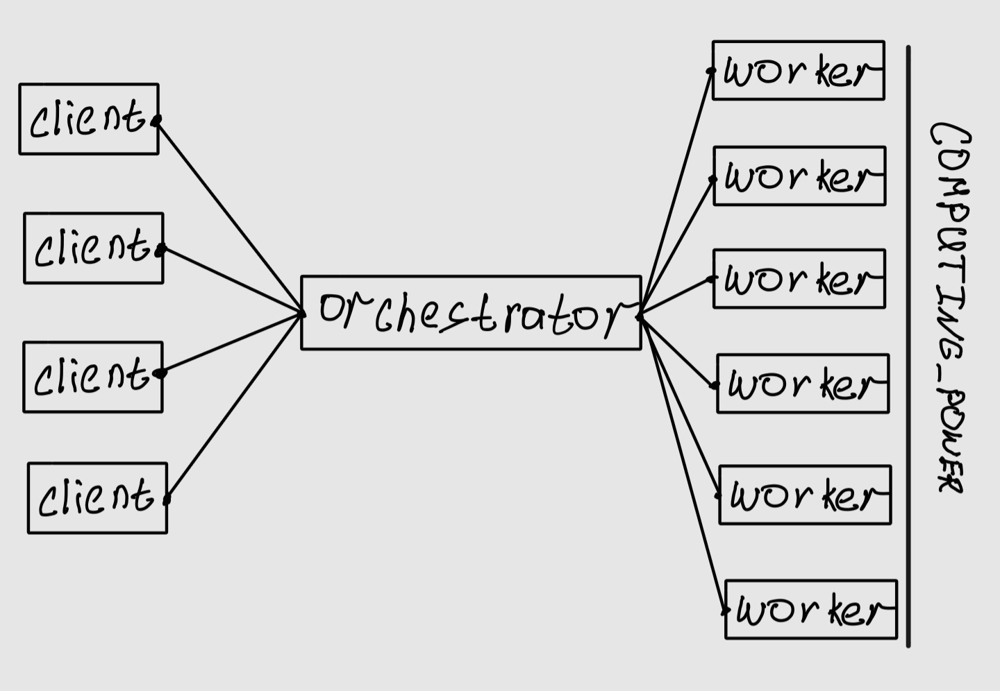

# GoroutineRPNServer

## Описание
Это серевер, кторый обрабатывает математическое выражение(может состоять только из `цифр`, `+`, `-`, `*`, `/`). Так же есть `web-interace`. Вкраце, есть `api`, которое получает от `web-interace` выражение, переводит его в RPN(Обратная польская нотация) и разбивате на "простые" таски.
Контакт тг: @OnYyon
## Навигация
- [Установка и запуск](#установка)
- [Как работает](#как-все-работает)
- [Примеры](#примеры)
## Установка и запуск
Установка `docker`(если не имееться в наличии)
- Идем по ссылке https://www.docker.com/
- Выбираем нужную платмформу и скачиваем

Клонируем репозиторий с `github`
```bash
git clone https://github.com/OnYyon/GoroutineRPNServer.git
```
Переходи в дирикторию проекта
```bash
cd GoroutineRPNServer
```
Запускаем `docker-compose`
```bash
docker-compose up --build 
```
>ВАЖНО: Ждем запуска программ
> Будет выведнно:
>>orchestrator-1  | Starting orhcestrator on localhost:8080
>>web-1           | Starting web-interface on localhost:8081
>>agent-1         | Starting gouroutine: 0
>>agent-1         | Starting gouroutine: 1
>> ...
>>agent-1         | Starting gouroutine: 12
>
> Только после этого все запуститься и можно пойти на [Web interface](http://localhost:8081)

## Как все работает

На картинке показан процесс поставление задачи клиентами. Все они обращаються к `оркестартору` он парсист выражение в RPN и делит RPN на таски. Количество воркеров задаеться переменнной среды `COMPUTING_POWER`
Посмотрим подробнее как работает раздение на таски.
```
RPN expression: 1 2 3 + + 4 5 + + 6 7 + + 4 3 * 8 / +
таски: (2 3 +), (4 5 +), (6 7 +), (4 3 *)

RPN expression: 1 5 + 9 + 13 + 12 8 / +
таски: (1 5 +), (12 8 /)

RPN expression: 6 9 + 13 + 1.5 +
таски: (6 9 +)

RPN expression: 15 13 + 1.5 +
таски: (15 13 +)

RPN expression: 28 1.5 +
таски: (28 1.5 +)

RPN expression: 29.5 - итоговый результат
```
Програма ищет тройки, кторые может выполнить сразу то есть все операторы однозначно определенны. И так пока не получит результат

## Примеры
Праивльный запрос
```bash
curl --location 'http://127.0.0.1:8080/api/v1/calculate' \
--header 'Content-Type: application/json' \
--data '{
    "expression": "((7+1)/(2+2)*4)/8*(32-((4+12)*2))-1"
}'
```
Правильный запрос с двумя одновременными запросами
```bash
curl -X POST http://127.0.0.1:8080/api/v1/calculate \
     -H "Content-Type: application/json" \
     -d '{"expression": "((7+1)/(2+2)*4)/8*(32-((4+12)*2))-1"}' &

curl -X POST http://127.0.0.1:8080/api/v1/calculate \
     -H "Content-Type: application/json" \
     -d '{"expression": "((7+1)/(2+2)*4)/8*(32-((4+12)*2))-1+((7+1)/(2+2)*4)/8*(32-((4+12)*2))-1"}' &
```
Непрвильный запрос
```bash
curl --location 'http://127.0.0.1:8080/api/v1/calculate' \
--header 'Content-Type: application/json' \
--data '{
    "expression": "+2"
}'
```
Запрос на просмотр всех выражений
```bash
curl --location 'http://127.0.0.1:8080/api/v1/expressions'
```
## Дерево проекта
```
.
├── README.md
├── cmd # Папка, где храняться файлы запуска agent и orchestrator
│   ├── agent
│   │   ├── dockerfile
│   │   └── main.go
│   └── orchestrator
│       ├── dockerfile
│       └── main.go
├── docker-compose.yaml
├── go.mod
├── go.sum
├── img
│   └── 1img.jpg
├── iternal
│   ├── agent
│   │   ├── handlers.go # Хендлеры для агента
│   │   ├── models.go # Все его структуры
│   │   ├── worker.go # Воркеры и логика вычислений
│   │   └── worker_test.go
│   ├── config
│   │   └── config.go # Для чтение переменных среды
│   ├── orchestrator
│   │   ├── handlers.go # Хендеры для оркестратора
│   │   ├── logic_test.go
│   │   ├── models.go # Все его структуры
│   │   └── utils.go # Функции, кторые помогают обрабатывать орекстратору
│   └── parser
│       └── parser.go # Парсе для перевода в RPN
└── web
    ├── dockerfile
    ├── main.go # Файл запуска web-interface
    ├── static
    │   ├── css
    │   │   └── styles.css
    │   └── js
    │       └── script.js # Для автоматического обновления таблицы
    └── templates
        └── index.html
```